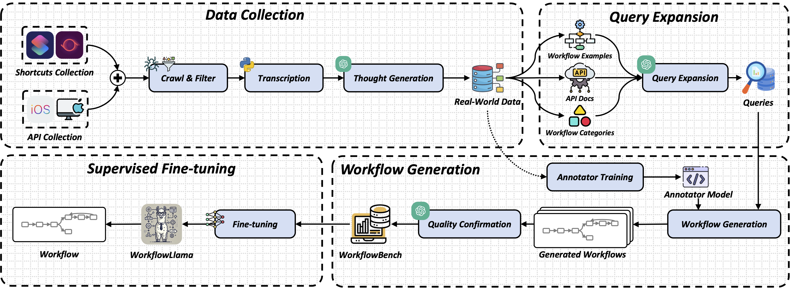
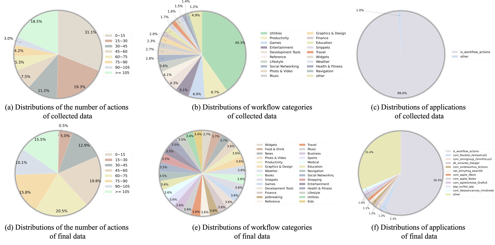
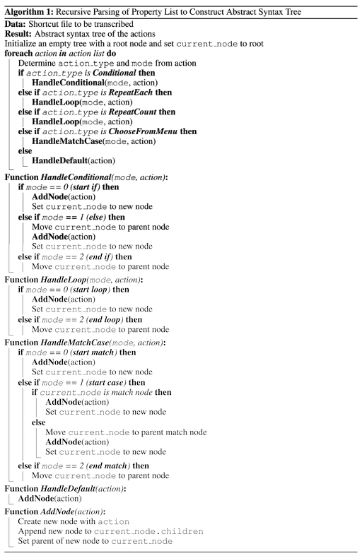

# WorkflowLLM: Enhancing Workflow Orchestration Capability of Large Language Models
<div align="center">


</div>

**WorkflowLLM** is a data-centric framework designed to enhance LLMs' capabilities in workflow orchestration. The core of WorkflowLLM is **WorkflowBench**, a large-scale supervised fine-tuning dataset containing **106,763 samples** across **1,503 APIs** from **83 applications** spanning **28 categories**.

---

## 🌐 What's New

- **[2024/10/29]** The WorkflowBench dataset is live, empowering WorkflowLLM with the capability to orchestrate workflows across thousands of real-world APIs. Discover the structured training and evaluation scripts provided in this repository to enable end-to-end API orchestration.

---

## 🚀 Overview

The creation of WorkflowBench follows three main phases:
1. **Data Collection**: We collect real-world Apple shortcuts from platforms like [RoutineHub](https://routinehub.co/), transcribing them into Python-style code. Additionally, we enhance the workflows with hierarchical thought generation using ChatGPT.
2. **Query Expansion**: ChatGPT is prompted to generate diverse and complex task queries to enrich the workflow dataset.
3. **Workflow Generation**: An annotator model trained on the collected data generates workflows for synthesized queries, which are then quality-checked and merged with collected samples to form the final dataset.

Using WorkflowBench, we fine-tune **Llama-3.1-8B** to create **WorkflowLlama**, a model specifically optimized for workflow orchestration tasks. Experimental results demonstrate that WorkflowLlama excels at orchestrating complex workflows and generalizes well to unseen APIs.



In all, WorkflowLLM offers a powerful tool for automating sophisticated workflows, enhancing LLM-based solutions for real-world applications in process automation.


---

[//]: # (## 📂 Dataset)

[//]: # ()
[//]: # (我们的数据集分为两部分，即转写后的real-world数据和额外的合成数据。这两部分数据关于action数量、workflow category及使用到的applications的分布图对比如下：)

[//]: # (![data-construction.pdf]&#40;./figs/dist-cmp.png&#41;)

[//]: # ()
[//]: # ()
[//]: # (Please download our dataset using the following link: [Google Drive]&#40;https://drive.google.com/file/d/1ybvkAL6vU2IIMK0X_N1nsWFmcc7KWs_r/view?usp=sharing&#41; and unzip it into `./data/`.)

[//]: # ()
[//]: # (- **Seed Data**: [./data/seed_data.json]&#40;./data/seed_data.json&#41;)

[//]: # (- **Synthesized Data**: [./data/synthesized_data.json]&#40;./data/synthesized_data.json&#41;)

## 📂 Dataset

### Dataset Overview

This dataset consists of two primary components: (1) transcribed real-world data, and (2) additional synthesized data. The distribution of action counts, workflow categories, and applications used across these two datasets is visually compared in the figure below:



### Dataset Access

Due to the limitations of anonymous GitHub access（8 MB for each file）, we are only able to provide the sampled dataset here.

The folder structure under `./data/` is as follows:

```markdown
./data/
│
├── dataset_split_keys.json
├── dataset_split_keys_ood.json
├── identifier2json.pkl
├── identifier2python.pkl
├── sampled_data.json
├── statistics.pkl
```


Here are some descriptions for the `data` directory:

- **dataset_split_keys.json**:  
  This file contains the dataset split for unseen instructions (In Distribution, ID). It defines how the data is divided based on new instructions that have not been seen during training.

- **dataset_split_keys_ood.json**:  
  Similar to `dataset_split_keys.json`, but for unseen APIs (Out of Distribution, OOD). This file contains the split for instructions and APIs that are out of distribution, designed for testing how the model handles APIs that weren't seen during training.

- **identifier2json.pkl**:  
  A Python pickle file that stores API documentation in JSON format. The data is indexed by an API\'s identifier, and it is used to reference the APIs' descriptions, parameters, and other relevant details.

- **identifier2python.pkl**:  
  Another Python pickle file that stores API documentation but in Python-specific format. This data can be used to access the same API information, but formatted for Python usage (e.g., type hints, docstrings).

- **sampled_data.json**:
  Due to the 8 MB file size limitation for anonymous GitHub uploads, we have only included a sampled subset of the data here. This file contains 300 real-world data entries and 300 synthetic data entries as training data, along with 50 test samples.

- **statistics.pkl**:  
A statistics file that contains summary information, such as the API categories used by each workflow, the number of actions, the number of nestings, and so on.

## 🔧 Environment Setup

- Python **3.8** is recommended.
- All dependencies are listed in `./requirements.txt` for ease of installation.

```bash
pip install -r requirements.txt
```

Additionally, we used the DeepSpeed Zero Stage 2 training configuration. The specific configuration file can be found in `./configs/ds_config.json`.


---

## 🛠 Data Preprocessing

Given that the original Apple Shortcuts use a property list (plist) format, which is not human-readable and poses challenges for model training, we first convert the data into an Abstract Syntax Tree (AST) representation. This transformation enhances both the readability and the utility of the data for further processing. The pseudocode for the conversion algorithm is illustrated below:



By performing a **pre-order traversal** of the AST, we are able to obtain Python code corresponding to the Shortcuts' logic.


To convert `.plist` or `.shortcut` files into a Python-compatible format, execute the following script:

```bash
python ./preprocess/Convert_ShortCut_to_Python.py --folder_path {folder_path}
```

After obtaining the transformed raw data, we used a prompt for ChatGPT to rename the variables and generate line-by-line comments for each workflow, along with the corresponding task plan and user query. The overall format of the data is as follows:

The format for each entry is shown in the figure below:


---

## 🧹 Data Pruning

### 1. GPT Pruning

The pruning process optimizes and refines the generated data produced by WorkflowLlama, ensuring higher quality and relevance. To perform pruning, you can run the provided script as follows:


Usage:

```bash
python ./src/prompt_GPT_for_prune.py --input_path <input_json_file> --save_path <output_json_file> --s <start_index> --t <end_index> --num_workers <num_threads>
````
Parameters:
- `--input_path`: Path to the WorkflowLlama output JSON file to be pruned (before pruning).
- `--save_path`: Path where the pruned data will be saved.
- `--s`: Starting index (inclusive) for the range of data samples to prune.
- `--t`: Ending index (inclusive) for the range of data samples to prune.
- `--num_workers`: Number of worker threads to use for parallel processing during the pruning operation.
### 2. Removing Empty Code and Filtering for API Consistency

To ensure the generated code is valid and consistent with the API specifications, you can use the `check_workflow_code_validity()` function, located in `./src/rule_based_filtering.py`. This function filters out any empty code and performs additional checks for API consistency.


---

## 🚅 Getting Started

### Overview
This repository contains tools for training and running inference with our model. Below, we provide instructions on how to begin training the model and running inference, along with useful configuration and troubleshooting information.

### Training the Model
To start training, execute the following command:

```bash
sh ./scripts/train.sh {BASE_MODEL_PATH} {DATA_PATH}
```

#### Parameters:
- **{BASE_MODEL_PATH}**: The path to the pre-trained model or an initial checkpoint to fine-tune. Ensure this path is valid and points to a compatible model checkpoint or architecture.
- **{DATA_PATH}**: The path to the dataset. 

For example, one may execute the command `sh ./scripts/train.sh Meta-Llama-3.1-8B-Instruct ./data/sampled_data.json`.

#### Additional Information:
- The training process will automatically load the dataset, configure the model, and begin training.
- The script supports logging and saving intermediate checkpoints. 


### Inference
Once the model has been trained, you can run inference using the following command:

```bash
sh ./scripts/infer.sh {LOAD_PATH}
```
#### Parameters:
- **{LOAD_PATH}**: The path to the trained model checkpoint. Ensure this points to a valid checkpoint directory or file that was saved during the training process.

## 📊 Model Experiments Result


| **Model**              | **BLEU (ID)** | **BLEU (OOD)** | **Weighted N-Gram (ID)** | **Weighted N-Gram (OOD)** | **AST (ID)** | **AST (OOD)** | **Data-Flow (ID)** | **Data-Flow (OOD)** | **Overall (ID)** | **Overall (OOD)** | **Pass Rate (ID)** | **Pass Rate (OOD)** |
|------------------------|---------------|----------------|--------------------------|---------------------------|--------------|---------------|---------------------|----------------------|------------------|-------------------|---------------------|----------------------|
| **Proprietary Models** |               |                |                          |                           |              |               |                     |                      |                  |                   |                     |                      |
| GPT-4o-mini            | 0.4           | 0.4            | 1.5                      | 1.6                       | 29.5         | 29.5          | 37.0                | 36.3                 | 26.8             | 26.5              | 54.8                | 47.5                 |
| _w/ ICL_               | 0.5           | 0.5            | 1.7                      | 1.8                       | 35.3         | 34.4          | 35.1                | 34.2                 | 28.3             | 27.7              | 66.0                | 57.7                 |
| GPT-4o                 | 0.5           | 0.4            | 1.8                      | 1.7                       | 33.5         | 31.8          | 37.3                | 36.9                 | 28.5             | 27.7              | 56.6                | 47.5                 |
| _w/ ICL_               | 0.5           | 0.5            | 1.8                      | 1.8                       | 37.1         | 35.3          | 38.0                | 36.6                 | 30.2             | 30.0              | 67.5                | 57.6                 |
| **Open-Source Models** |               |                |                          |                           |              |               |                     |                      |                  |                   |                     |                      |
| Qwen2-7B               | 0.4           | 0.4            | 1.2                      | 1.3                       | 27.2         | 27.7          | 33.2                | 33.1                 | 24.4             | 24.5              | 25.6                | 22.6                 |
| _w/ ICL_               | 0.5           | 0.5            | 1.2                      | 1.3                       | 30.2         | 29.8          | 32.4                | 32.9                 | 25.2             | 25.3              | 28.2                | 26.4                 |
| Llama-3.1-8B           | 0.6           | 0.7            | 1.2                      | 1.4                       | 31.0         | 29.6          | 30.0                | 30.8                 | 24.6             | 24.3              | 33.0                | 24.5                 |
| _w/ ICL_               | 0.7           | 0.7            | 1.3                      | 1.4                       | 34.0         | 32.4          | 32.6                | 32.4                 | 25.3             | 25.2              | 40.2                | 32.7                 |
| Llama-3.1-70B          | 0.4           | 0.4            | 1.4                      | 1.5                       | 29.9         | 30.0          | 37.8                | 37.6                 | 27.3             | 27.2              | 55.4                | 42.3                 |
| _w/ ICL_               | 0.4           | 0.4            | 1.6                      | 1.5                       | 34.1         | 32.9          | **39.1**            | **38.4**             | 29.5             | 28.7              | 67.6                | 61.4                 |
| **WorkflowLlama (8B)** | **9.4**       | **7.0**        | **11.09**                | **8.3**                    | **55.1**     | **48.8**      | 38.0                | 35.3                 | **39.3**         | **35.1**          | **76.9**            | **70.4**             |

## Citation
Feel free to us if you like WorkflowLLM.


## License

This project is licensed under the Apache License 2.0 - see the [LICENSE](LICENSE) file for details.


